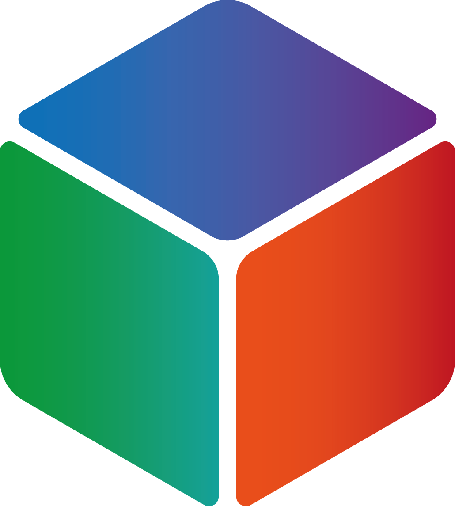

# Cube NXN
Interactive Rubik’s Cube platform for learning, solving, and tracking NxN cubes.
## try it here at ``https://cubenxn.com/``:
<p align="center">
  <a href="https://cubenxn.com/">
    
  </a>
</p>

## Features

* Interactive animated homepage
* Create and manage custom NxN cubes
* Step-by-step tutorial mode
* Solve timer and personal best tracking
* Cube customisation options
* Light/Dark mode support
* Responsive UI with smooth animations

## Dashboard

* Add cubes of different sizes
* Open or remove cubes
* Track total cube usage time
* View solve history and PB times

## Tutorial Mode

* Guided solving tutorials
* Slide navigation
* Play/reset animations
* Progress tracking
* Optional colour-blocking mode for easier learning

## Cube Controls

| Action             | Description             |
| ------------------ | ----------------------- |
| Right Click + Drag | Rotate cube or layers   |
| Left Click + Drag  | Peek around the cube    |
| Left Arrow         | Previous tutorial slide |
| Right Arrow        | Next tutorial slide     |
| ➕ / ➖              | Zoom in or out          |

## Tech Stack

* HTML
* CSS
* JavaScript

## Run Locally

```bash
git clone <repo-url>
cd cube-nxn
```

Open `index.html` in your browser.

## Feedback

Feedback and suggestions are welcome.

📧 [arya.prakashyt@gmail.com](mailto:arya.prakashyt@gmail.com)

